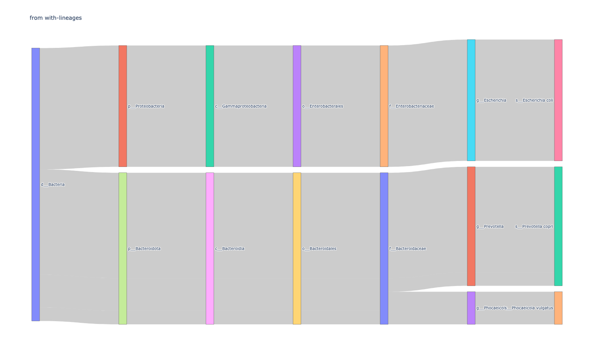

# 2025-sourmash-sankey


## Create/Activate Environment

```
mamba env create -f environment.yml
mamba activate 2025-sourmash-sankey
```

## Run test files

### From tax metagenome
```
python plot-sankey.py --summary-csv test.tax-mg.summarized.csv --title 'from csv_summary' -o test.csv-summary.html  
```


> example interactive HTML file available at 'test.csv-summary.html'

### From tax annotate
```
python plot-sankey.py --annotate-csv test1.gather.with-lineages.csv --title 'from with-lineages' -o test.with-lineages.html
```

> example interactive HTML file available at 'test.with-lineages.html'


## Authors

- N. Tessa Pierce-Ward
